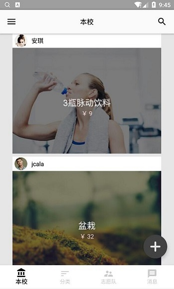
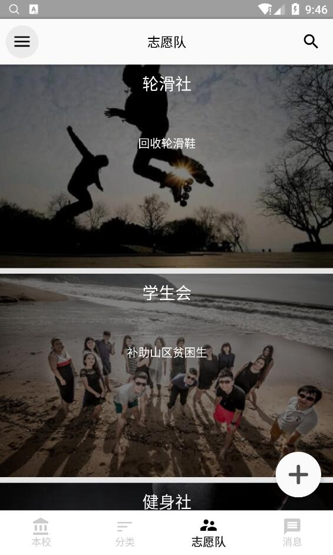
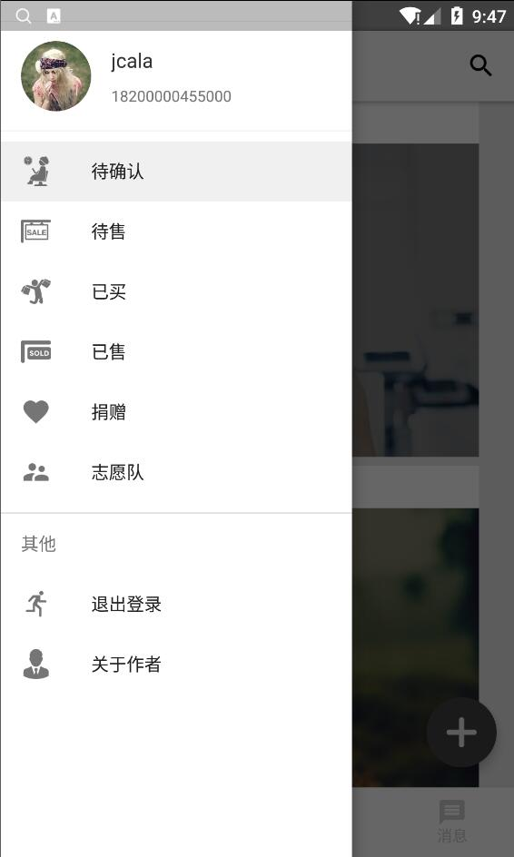
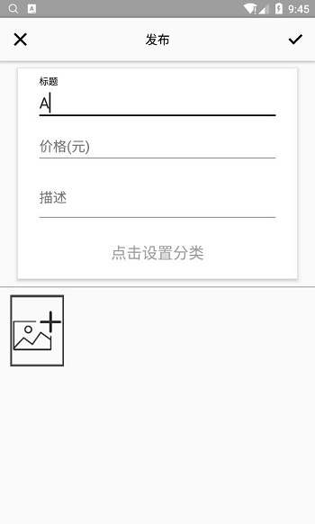

## MVP开发模式的交易市场APP

####[APP的后端  https://github.com/jcalaz/xmarket-server](https://github.com/jcalaz/xmarket-server)

正在开发中。。。

### 所用技术及模式

- MVP开发模式
- Retrofit: HTTP框架
- Rxjava: 响应式编程
- Dagger2: 依赖注入
- ButterKnife: 资源绑定
- Logger: 日志工具
- Fresco: 图片处理
- Lombok: 注解生成代码小工具
- Rxgalleryfnal: 图片选择器

